# Witty Blog — Blog Management System

A full-stack MERN blog platform with rich-text editing, image uploads, JWT authentication, and transactional emails. Built for writers and readers, deployed on Vercel (frontend) and Render (backend).


---

## Overview

**Witty Blog** is a modern blog management system that lets authenticated users write, edit, and publish rich-text posts with inline images, organize them into categories, and share them with readers. It includes full authentication, password recovery via email, profile management with avatar uploads, and account deletion.

The project is split into two independently deployable applications:

- **`client/`** — React SPA (Vite), deployed on Vercel
- **`server/`** — Express REST API (Node.js), deployed on Render
- **Database** — MongoDB Atlas
- **Media** — Cloudinary
- **Email** — EmailJS over SMTP

---

## Features

### Authentication & Security
- User registration with welcome email
- Login with JWT (stored in httpOnly cookie **and** localStorage for API calls)
- Forgot password / reset password via email
- Change password from profile
- Delete account (with cascade deletion of the user's posts)
- Protected routes on both frontend and backend
- Role-based access control (`user`, `admin`)

### Content Management
- Rich-text editor (TipTap) with support for:
  - Bold, italic, underline
  - Headings (H2, H3)
  - Bullet and numbered lists
  - Blockquotes, code blocks
  - Links
  - **Inline image uploads to Cloudinary** (drag, click, and paste-ready)
- Featured image per post
- Auto-generated plain-text excerpts from HTML content
- Full CRUD for posts (create, read, update, delete)
- Author ownership verification on edit/delete

### Categories
- Create, read, update, delete categories
- Post count per category (computed on the fly)
- Category-owner validation
- Prevent deletion of categories with existing posts
- Browse posts filtered by category

### User Profile
- Avatar upload to Cloudinary
- Editable name, email, bio (250 chars), location, website
- Auto-normalization of website URLs (prepends `https://` if missing)
- Member since date
- Admin badge for admin users
- Danger zone with typed confirmation for account deletion

### Discovery
- Client-side and server-side search (title, content, author, category)
- Pagination for posts
- Home page with hero, features, FAQ
- Responsive design (mobile-first, MUI v7 breakpoints)

### UI/UX
- Material UI v7
- Toast notifications (react-toastify)
- Loading spinners and skeletons
- Confirm dialogs for destructive actions
- Empty states with CTAs
- Gradient hero on the home page
- Sticky navbar with avatar dropdown

---

## Screenshots

### Authentication

| Login | Register | Forgot Password |
|-------|----------|-----------------|
| 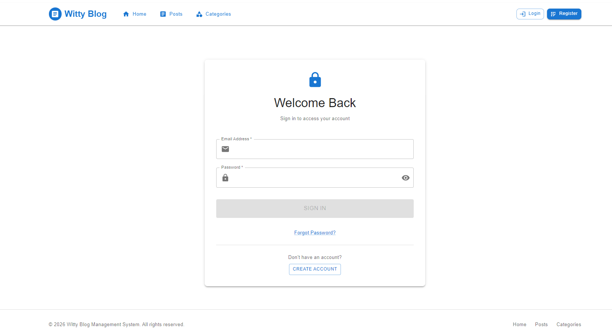 | 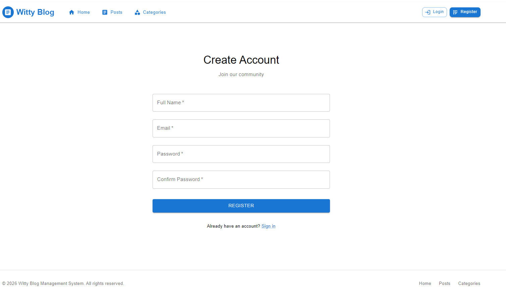 | 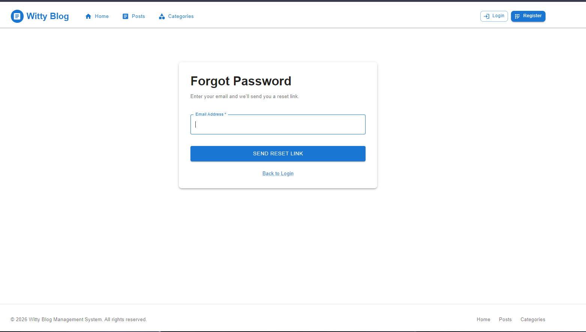 |

### Home

| Homepage | Homepage (scrolled) |
|----------|---------------------|
| 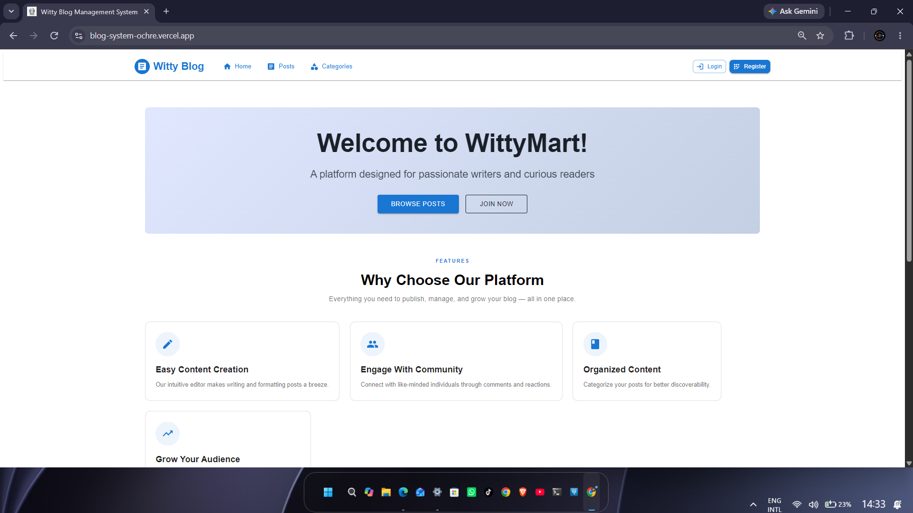 | 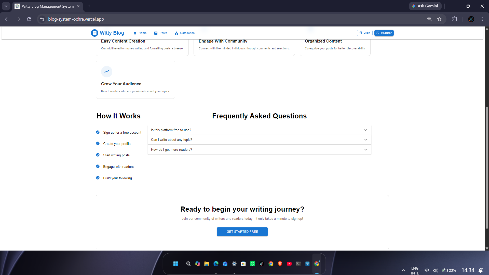 |

###  Posts

| All Posts | Single Post | Single Post (content) |
|-----------|-------------|-----------------------|
| 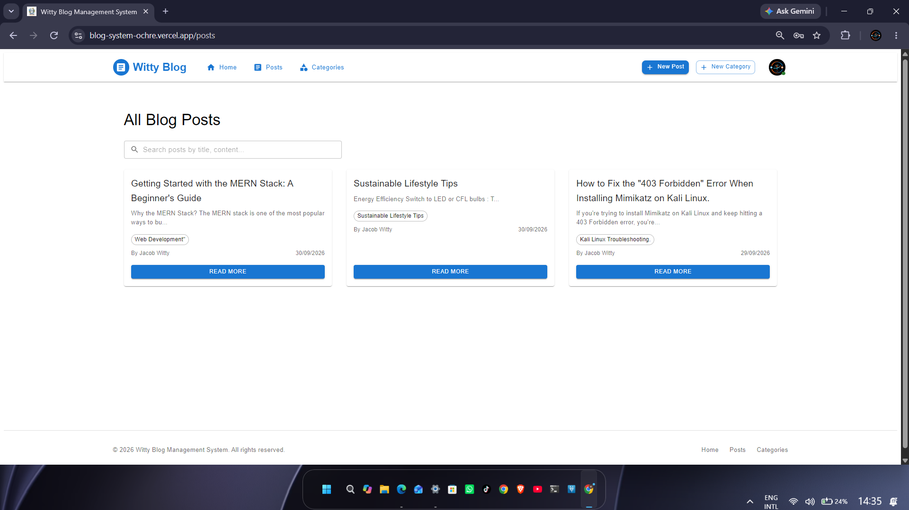 | 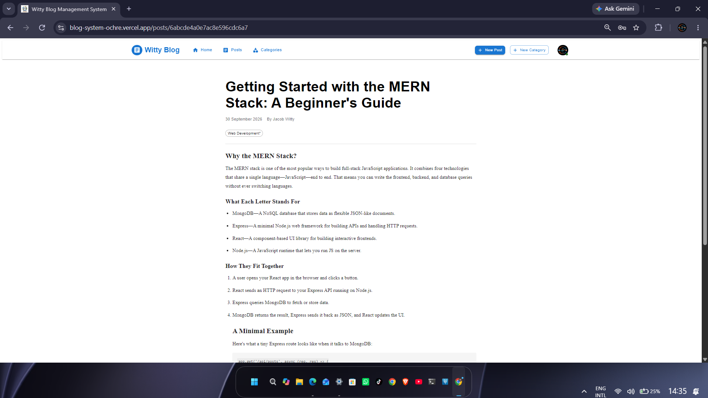 | 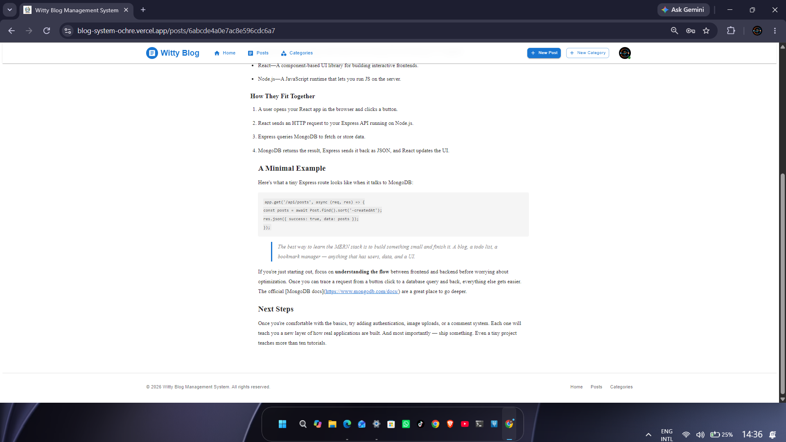 |

| Create Post | Categorized Posts |
|-------------|-------------------|
| 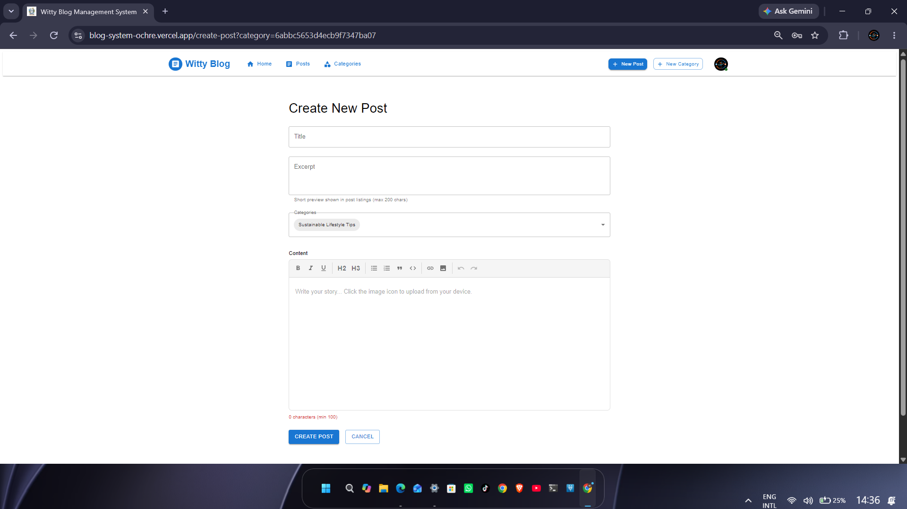 | 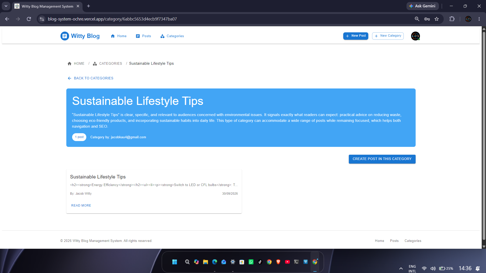 |

###  Categories

| Categories | Create Category |
|------------|-----------------|
| 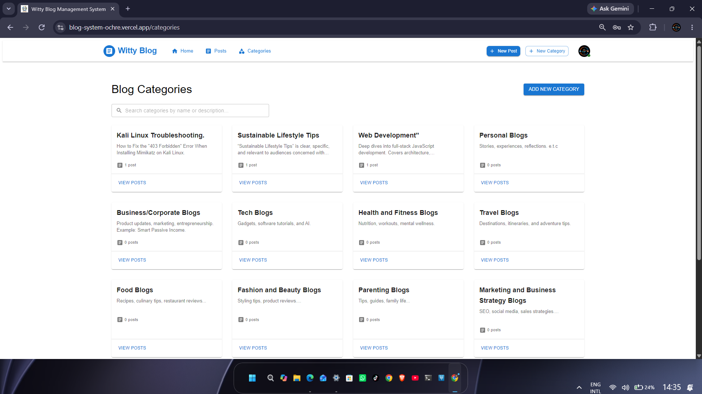 | 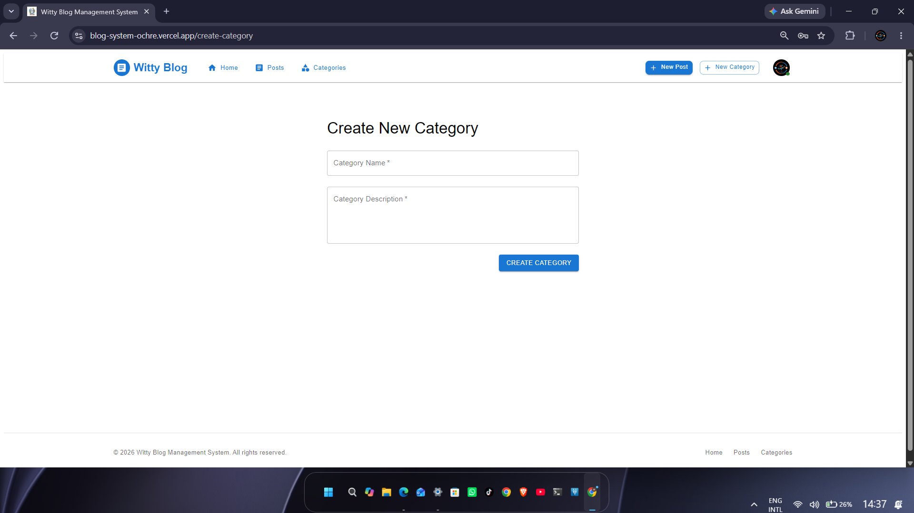 |

###  Profile

| Profile | Edit Profile | Danger Zone |
|---------|--------------|-------------|
| 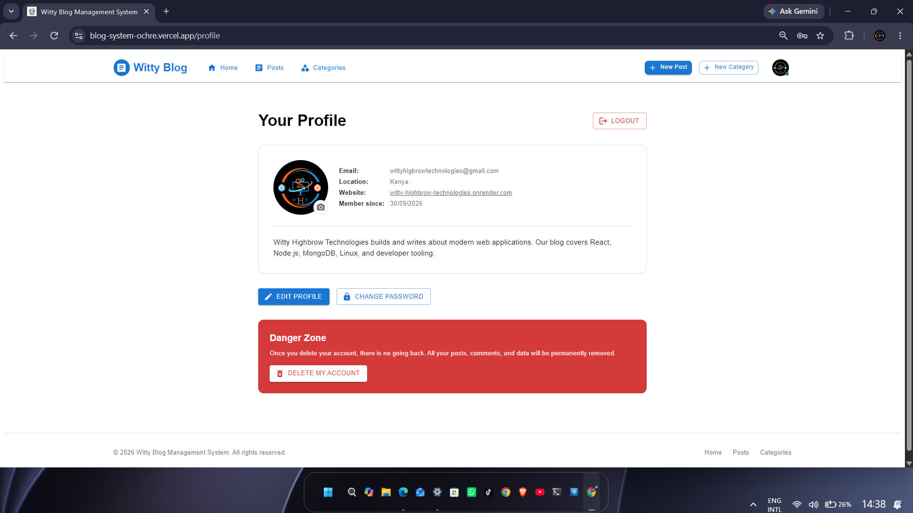 | 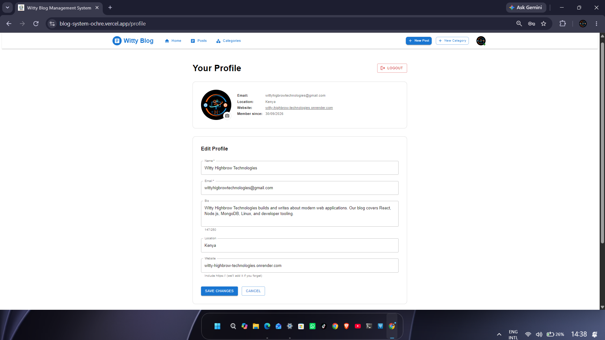 |  |

###  Error Pages

| 404 Not Found |
|---------------|
|  |

## Tech Stack

### Frontend
| Package | Purpose |
|---------|---------|
| React 19 | UI library |
| Vite 7 | Build tool |
| React Router 7 | Client-side routing |
| Material UI 7 | Component library |
| TipTap 2 | Rich-text editor |
| Axios | HTTP client |
| React Hook Form + Yup | Form validation |
| react-toastify | Notifications |
| DOMPurify | HTML sanitization |
| @emailjs/browser | Client-side email sending |
| date-fns | Date utilities |

### Backend
| Package | Purpose |
|---------|---------|
| Node.js | Runtime |
| Express 4 | Web framework |
| Mongoose 8 | MongoDB ODM |
| jsonwebtoken | JWT auth |
| bcryptjs | Password hashing |
| cookie-parser | Cookie support |
| cors | Cross-origin handling |
| multer | File upload parsing |
| cloudinary | Media storage |
| dotenv | Env var management |
| morgan | Request logging (dev) |

### Infrastructure
- **MongoDB Atlas** — database
- **Cloudinary** — image CDN
- **EmailJS + Gmail SMTP** — transactional emails
- **Render** — backend hosting
- **Vercel** — frontend hosting

---

## Project Structure

```
Blog-system/
├── client/                          # React frontend (Vite)
│   ├── public/
│   │   └── logo.png
│   ├── src/
│   │   ├── api/                    # Axios API wrappers
│   │   │   ├── auth.js
│   │   │   ├── categories.js
│   │   │   ├── posts.js
│   │   │   └── uploads.js
│   │   ├── components/
│   │   │   ├── auth/              # ProtectedRoute
│   │   │   ├── editor/            # RichTextEditor (TipTap)
│   │   │   ├── layout/            # Navbar, Footer, Layout
│   │   │   ├── posts/             # PostList
│   │   │   └── ui/                # SearchBar, Spinner
│   │   ├── context/               # AuthProvider, useAuth
│   │   ├── pages/
│   │   │   ├── auth/              # Login, Register, Forgot, Reset
│   │   │   ├── categories/        # Categories, CategoryPosts, Create, Edit
│   │   │   ├── posts/             # Posts, SinglePost, Create, Edit
│   │   │   ├── user/              # Profile
│   │   │   ├── Home.jsx
│   │   │   └── NotFound.jsx
│   │   ├── App.jsx                # Routes
│   │   └── main.jsx               # Entry
│   └── package.json
│
├── server/                          # Express backend
│   ├── controllers/
│   │   ├── auth.js                 # Register, login, reset, delete
│   │   ├── posts.js                # Post CRUD + search
│   │   ├── categories.js           # Category CRUD
│   │   ├── uploads.js              # Cloudinary upload
│   │   └── avatar.js               # User avatar upload
│   ├── middleware/
│   │   ├── Auth.js                 # protect, authorize, errorHandler
│   │   ├── async.js                # asyncHandler wrapper
│   │   └── advancedResults.js      # Populate/sort/paginate
│   ├── models/
│   │   ├── User.js
│   │   ├── Post.js
│   │   └── Category.js
│   ├── routes/
│   │   ├── auth.js
│   │   ├── posts.js
│   │   ├── categories.js
│   │   └── uploads.js
│   ├── utils/
│   │   └── errorResponse.js
│   ├── app.js                       # Express app entry
│   └── package.json
│
└── README.md
```


##  Getting Started

### Prerequisites

- **Node.js** 18+ and npm
- **MongoDB Atlas** account (free tier works)
- **Cloudinary** account (free tier works)
- **EmailJS** account (free tier works)
- **Gmail** account with 2-Step Verification enabled (for SMTP)

### 1. Clone the Repository

```bash
git clone https://github.com/your-username/Blog-system.git
cd Blog-system
```

### 2. Set Up the Backend

```bash
cd server
npm install
```

Create `server/.env`:

```env
# Database
MONGO_URI=mongodb+srv://<user>:<pass>@cluster.mongodb.net/blog-system

# JWT
JWT_SECRET=your-super-secret-jwt-key
JWT_EXPIRE=30d
JWT_COOKIE_EXPIRE=30

# Server
NODE_ENV=development
PORT=5000
CLIENT_URL=http://localhost:5173

# Cloudinary
CLOUDINARY_CLOUD_NAME=your-cloud-name
CLOUDINARY_API_KEY=your-api-key
CLOUDINARY_API_SECRET=your-api-secret
```

Start the backend:

```bash
npm run dev
```

The API will be running at `http://localhost:5000`.

### 3. Set Up the Frontend

```bash
cd ../client
npm install
```

Create `client/.env`:

```env
VITE_API_URL=http://localhost:5000/api

# EmailJS
VITE_EMAILJS_SERVICE_ID=service_xxxxxxx
VITE_EMAILJS_TEMPLATE_ID=template_xxxxxxx
VITE_EMAILJS_WELCOME_TEMPLATE_ID=template_xxxxxxx
VITE_EMAILJS_PUBLIC_KEY=xxxxxxxxxxxxxxxx
```

Start the frontend:

```bash
npm run dev
```

The app will be running at `http://localhost:5173`.

---

## EmailJS Setup

Witty Blog uses **EmailJS with Gmail SMTP** to send emails without a custom domain.

### Why SMTP instead of OAuth?

- **Gmail API (OAuth)** restricts sends to your own address until you verify a domain with Google — not suitable for a public blog.
- **Gmail SMTP + App Password** can send to **any recipient** without domain verification.

### How to Configure

1. **Enable 2-Step Verification** at [myaccount.google.com/security](https://myaccount.google.com/security)
2. **Generate an App Password** at [myaccount.google.com/apppasswords](https://myaccount.google.com/apppasswords)
3. In EmailJS → **Email Services** → **Add New Service** → **SMTP server**:

   | Field | Value |
   |-------|-------|
   | Host | `smtp.gmail.com` |
   | Port | `465` |
   | SSL |  Enabled |
   | User | `your-gmail@gmail.com` |
   | App Password | the 16-char password |

4. Create **two templates**:
   - **Password Reset** — variables: `{{to_name}}`, `{{to_email}}`, `{{reset_link}}`, `{{from_name}}`, `{{current_year}}`
   - **Welcome Email** — variables: `{{to_name}}`, `{{to_email}}`, `{{site_url}}`, `{{from_name}}`, `{{current_year}}`

5. Copy the **Service ID** and both **Template IDs** into your `.env`.

---

## Deployment

### Backend — Render

1. Push code to GitHub
2. Create a **New Web Service** on [render.com](https://render.com)
3. Connect your repo, set **Root Directory** to `server`
4. Add environment variables (same as `.env`)
5. Deploy

### Frontend — Vercel

1. Create a project on [vercel.com](https://vercel.com)
2. Import your repo, set **Root Directory** to `client`
3. Add environment variables (`VITE_*`)
4. Deploy

### Important Notes

- **Env var changes require a redeploy.** Vite bakes them into the bundle at build time.
- **Render's free tier has a Cloudflare WAF** that can block large PUT bodies. Mitigation: use POST for update endpoints, or upgrade to a paid plan.
- **CORS is strict.** Add every production URL to `allowedOrigins` in `server/app.js`.

---

## API Endpoints

### Auth — `/api/auth`

| Method | Endpoint | Access | Description |
|--------|----------|--------|-------------|
| POST | `/register` | Public | Create a new user |
| POST | `/login` | Public | Authenticate and receive JWT |
| POST | `/forgot-password` | Public | Generate reset link |
| PUT | `/reset-password/:token` | Public | Reset password with token |
| GET | `/logout` | Private | Clear auth cookie |
| GET | `/me` | Private | Get current user |
| PUT | `/updatedetails` | Private | Update name/email/bio/location/website |
| PUT | `/updatepassword` | Private | Change password |
| PUT | `/avatar` | Private | Upload avatar (multipart) |
| DELETE | `/account` | Private | Delete current account |

### Posts — `/api/posts`

| Method | Endpoint | Access | Description |
|--------|----------|--------|-------------|
| GET | `/` | Public | List posts (`?page`, `?limit`, `?sort`, `?search`) |
| GET | `/category/:categoryId` | Public | Posts in a category |
| GET | `/:id` | Public | Single post |
| POST | `/` | Private | Create post |
| PUT | `/:id` | Private | Update post (owner or admin) |
| DELETE | `/:id` | Private | Delete post (owner or admin) |

### Categories — `/api/categories`

| Method | Endpoint | Access | Description |
|--------|----------|--------|-------------|
| GET | `/` | Public | List categories with post counts |
| GET | `/:id` | Public | Single category |
| POST | `/` | Private | Create category |
| PUT | `/:id` | Private | Update category (owner or admin) |
| DELETE | `/:id` | Private | Delete empty category (owner or admin) |

### Uploads — `/api/uploads`

| Method | Endpoint | Access | Description |
|--------|----------|--------|-------------|
| POST | `/` | Private | Upload image to Cloudinary |

---

## Data Models

### User

```javascript
{
  name: String (required),
  email: String (required, unique, lowercase),
  password: String (required, min 6, select: false),
  role: String (enum: ['user', 'admin'], default: 'user'),
  avatar: String (Cloudinary URL),
  bio: String (max 250),
  location: String (max 100),
  website: String,
  passwordResetToken: String (select: false),
  passwordResetExpires: Date (select: false),
  createdAt: Date
}
```

### Post

```javascript
{
  title: String (required, max 100),
  content: String (required, HTML),
  excerpt: String (required, max 200),
  featuredImage: String (default 'no-photo.jpg'),
  author: ObjectId → User (required),
  categories: [ObjectId] → Category,
  comments: [ObjectId] → Comment,
  createdAt: Date,
  updatedAt: Date
}
```

### Category

```javascript
{
  name: String (required, unique, max 50),
  description: String (max 500),
  owner: ObjectId → User (required),
  postCount: Number (default 0),
  createdAt: Date
}
```

---

## Common Issues & Fixes

### "CORS policy: No 'Access-Control-Allow-Origin' header"

Add your production URL to `allowedOrigins` in `server/app.js`. Remember to add CORS headers on **error responses** too (in `server/middleware/Auth.js`).

### "The recipients address is empty" (EmailJS)

Your template's **To Email** field must be `{{to_email}}`. The frontend sends `to_email`, not `email`.

### "Invalid grant. Please reconnect your Gmail account"

You're using the **Gmail API** service in EmailJS, not **SMTP**. Delete the Gmail API service, create an SMTP one, and redeploy with the new `VITE_EMAILJS_SERVICE_ID`.

### Env var is `undefined` in the browser

Vite bakes env vars in at build time. After adding or changing a `VITE_*` variable in Vercel, **redeploy** — the running bundle still has the old values.

### 403 on `PUT /api/posts/:id` (Render)

Cloudflare's WAF on Render's free tier blocks large PUT bodies containing HTML. Mitigation: use `POST` on `/api/posts/:id` (add a route alias on the backend).

### Mongo SSL error: `tlsv1 alert internal error`

Whitelist `0.0.0.0/0` in MongoDB Atlas → Network Access. Or update `mongoose` and `mongodb` to their latest versions.

---

## Scripts

### Client

```bash
npm run dev       # Start Vite dev server
npm run build     # Production build
npm run preview   # Preview production build
npm run lint      # ESLint
```

### Server

```bash
npm run dev       # Start with nodemon
npm start         # Start in production
```

---

## Contributing

1. Fork the repo
2. Create a feature branch (`git checkout -b feature/amazing-feature`)
3. Commit your changes (`git commit -m 'Add amazing feature'`)
4. Push to the branch (`git push origin feature/amazing-feature`)
5. Open a Pull Request

---

##  License

This project is licensed under the MIT License.

---

## Author

**Witty Highbrow Technologies**
- Email: wittyhighbrowtechnologies@gmail.com
- Blog: [blog-system-ochre.vercel.app](https://blog-system-ochre.vercel.app)

---

## Acknowledgments

- [MUI](https://mui.com/) for the component library
- [TipTap](https://tiptap.dev/) for the rich-text editor
- [Cloudinary](https://cloudinary.com/) for image hosting
- [EmailJS](https://www.emailjs.com/) for client-side emails
- [MongoDB Atlas](https://www.mongodb.com/atlas) for the database
- [Render](https://render.com/) and [Vercel](https://vercel.com/) for hosting

---

**Built by Witty Highbrow Technologies**
