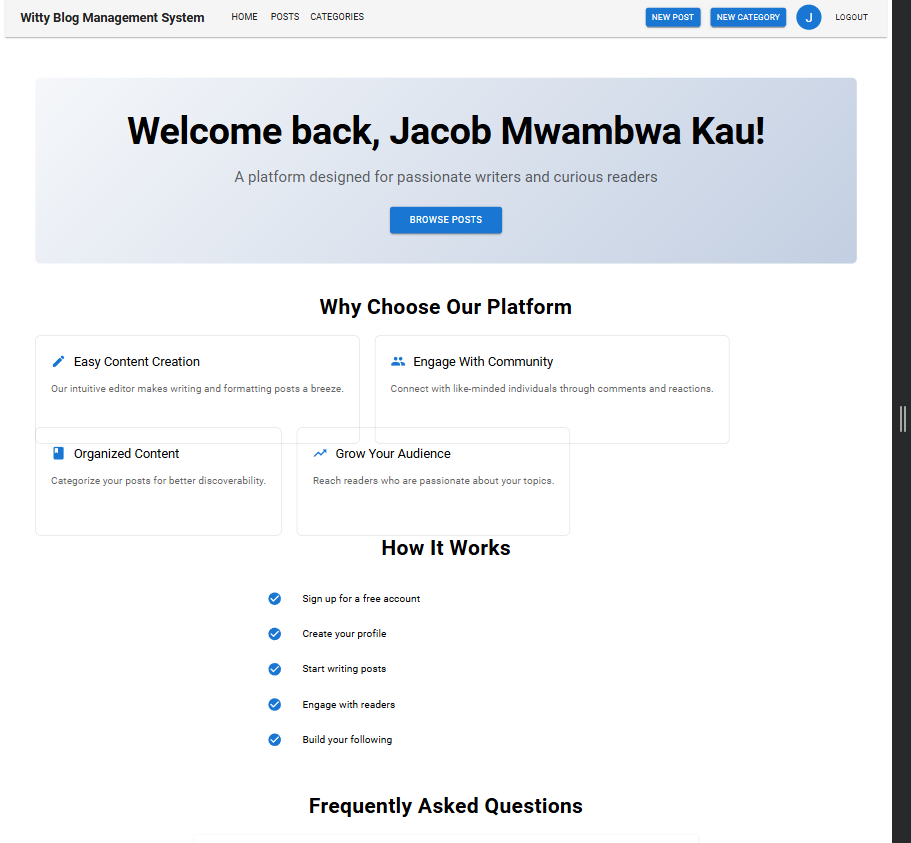

# Witty Blog Management

## 📖 Project Overview

A full-featured blogging platform built using the MERN stack (MongoDB, Express.js, React, Node.js). It allows users to create, update, and delete blog posts, manage categories, and interact with posts through comments and likes.

---

## 🚀 Features Implemented

- User authentication (register/login with JWT)
- Create, read, update, delete (CRUD) blog posts
- Category management 
- Rich text editor for post content
- Pagination and sorting
- Responsive design using Material UI
- Form validation with Yup + React Hook Form

---

## ⚙️ Setup Instructions

### Prerequisites

- Node.js & npm
- MongoDB (local or cloud - e.g., MongoDB Atlas)

### 1. Clone the repository

```bash
git clone https://github.com/you/mern-blog-platform.git
cd mern-blog-platform
```

### 2. Backend Setup

```bash
cd server
npm install
cp .env.example .env  # Update with your credentials
npm run dev
```

### 3. Frontend Setup

```bash
cd client
npm install
npm run dev
```

The client should now be running at `http://localhost:5173` and server at `http://localhost:5000`.

---

## 📚 API Documentation

### Auth Routes

- `POST /api/auth/register` – Register new user
- `POST /api/auth/login` – Authenticate user

### Post Routes

- `GET /api/posts` – Fetch all posts (supports pagination, sorting)
- `GET /api/posts/:id` – Fetch a specific post
- `POST /api/posts` – Create post (requires auth)
- `PUT /api/posts/:id` – Update post (author or admin only)
- `DELETE /api/posts/:id` – Delete post (author or admin only)

### Category Routes

- `GET /api/categories` – Fetch all categories
- `POST /api/categories` – Create new category

---

## 🖼 Screenshots

### Home Page


---

## 📄 License

This project is open-source and available under the [MIT License](LICENSE).

---

## 🙌 Credits

Created with ❤️ by Jacob Mwambwa @2025.
